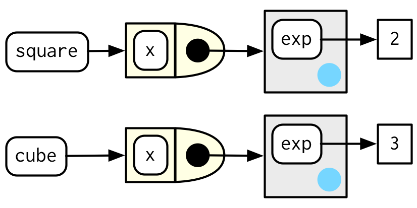

<style type="text/css">
body{
     font-family: Verdana;
     font-size: 12pt;
     background-color:#FAFAFA;
}
code.r{
     font-size: 10pt;
     font-family: "Gills Sans TM";
}
pre{
     font-size: 10pt;
     font-family: "Gills Sans TM";
}
<!-- div.tutorial-exercise{ -->
<!--      font-size: 20pt !important; -->
<!--      font-family: "Gills Sans TM"; -->
<!-- } -->
</style>


```{r setup, include=FALSE}
library(learnr)
library(rlang)
library(ggplot2)
library(scales)

power1 <- function(exp) {
  function(x) {
    x ^ exp
  }
}

square <- power1(2)
cube <- power1(3)


new_counter <- function() {
  i <- 0
  
  function() {
    i <<- i + 1
    i
  }
}

counter_one <- new_counter()
counter_two <- new_counter()

sd <- c(1, 5, 15)
n <- 100

df <- data.frame(x = rnorm(3 * n, sd = sd), sd = rep(sd, n))

names <- list(
  square = 2, 
  cube = 3, 
  root = 1/2, 
  cuberoot = 1/3, 
  reciprocal = -1
)
funs <- purrr::map(names, power1)


```

```{css echo=FALSE}
.custom-inline {
  color: red;
  font-weight: 700
}
```


# <span style="color:#3c1361">Fábricas de Funciones</span>

## <span style="color:#52307c">10.1 Introducción</span>


Una **fábrica de funciones** es una función que crea funciones. Aquí hay un ejemplo muy simple: usamos una fábrica de funciones `power1()`  para hacer dos funciones secundarias `square()` y `cube()`:


```{r}

power1 <- function(exp) {
  function(x) {
    x ^ exp
  }
}

square <- power1(2)
cube <- power1(3)

```

Llamarmos a  `square()` y `cube()` **funciones manufacturadas**, pero desde la perspectiva de R, no son diferentes a las funciones creadas de otra manera.

```{r p2, exercise=TRUE}

square(3)
cube(3)

```

Existen tres principales herramientas de programación funcional (**funcionales, fábricas de funciones y operadores de funciones**), de las cuáles, las fábricas de funciones son las menos utilizadas. Por lo general, no tienden a reducir la complejidad general del código, sino que la dividen en trozos más fáciles de digerir. Las fábricas de funciones también son un bloque de construcción importante para los operadores de funciones.

Las fábricas de funciones solo necesitan R base, sin embargo, usaremos un poco de `rlang` para mirar dentro de ellas más fácilmente, y usaremos `ggplot2` y `scales` para explorar el uso de las fábricas de funciones en la visualización.

```{r, message=FALSE}

library(rlang)
library(ggplot2)
library(scales)

```

## 10.2 Fundamentos de Fabrica

La idea clave que hace que las fábricas de funciones funcionen se puede expresar de manera muy concisa:

*El entorno envolvente de la función fabricada es un entorno de ejecución de la fábrica de funciones.*

Solo se necesitan pocas palabras para expresar estas grandes ideas, pero se necesita mucho más trabajo para comprender realmente lo que esto significa. Esta sección nos ayudará a unir las piezas con exploración interactiva y algunos diagramas.

### 10.2.1 Entornos

Comencemos echando un vistazo a `square()` y `cube()`:

```{r two-plus-two, exercise=TRUE}

square
cube

```

Es obvio de dónde vine `x`, pero, ¿Cómo encuentra R el valor asociado con `exp`? 

Simplemente imprimir las funciones fabricadas no es revelador porque los cuerpos son idénticos; el contenido del **entorno circundante** es el factor importante. Podemos obtener un poco más de información utilizando `rlang::env_print()`. 

```{r p4, exercise=TRUE}

env_print(square)
env_print(cube)

```

Lo cual nos muestra que tenemos **dos entornos diferentes** (cada uno de los cuales era originalmente un entorno de ejecución de `power1()`). Los entornos tienen el mismo padre, que es el entorno envolvente del entorno global `power1()`.
`env_print()` nos muestra que ambos entornos tienen un enlace a `exp`, pero queremos ver su valor.

Podemos hacer eso obteniendo primero el entorno de la función y luego extrayendo los valores:

```{r p5, exercise=TRUE}

fn_env(square)$exp
fn_env(cube)$exp

```

Esto es lo que hace que las funciones fabricadas se comporten de manera diferente entre sí: **los nombres en el entorno circundante están vinculados a valores diferentes**.

### 10.2.2 Convenciones de diagramas

También podemos mostrar estas relaciones en un diagrama:

```{r, out.width='60%', fig.align='center', echo=FALSE}
knitr::include_graphics('images/10.2.2 Image 1.png')
```

Están sucediendo muchas cosas en este diagrama y algunos de los detalles no son tan importantes. Podemos simplificar considerablemente usando dos convenciones:

 * Cualquier símbolo de flotación libre vive en el entorno global.
 * Cualquier entorno sin un padre explícito hereda del entorno global.

```{r, out.width='60%', fig.align='center', echo= FALSE}

```

Esta vista, que se centra en los entornos, no muestra ningún vínculo directo entre `cube()` y `square()`. 
Eso es porque el enlace es a través del cuerpo de la función, que es idéntico para ambos, pero no se muestra en este diagrama.

Para terminar, veamos el entorno de ejecución de `square(10)`. Cuando se ejecuta `square()`, `x ^ exp` encuentra `x` en el entorno de ejecución y `exp` en su entorno envolvente.

```{r p6, exercise=TRUE}

square(10)

```

### 10.2.3 Forzar la evaluación

Hay un bug sutil en `power1()` causado por una evaluación perezosa (*lazy evaluation*). Para ver el problema, necesitamos introducir alguna indirección.

```{r p7, exercise=TRUE}

x <- 2
square <- power1(x)
x <- 3

```

¿Qué debería `square(2)` devolver como resultado? Esperaría que devuelva 4:

```{r p8, exercise=TRUE}

square(2)

```

Desafortunadamente, no es así porque `x` solo se evalúa de manera perezosa cuando `square()` se ejecuta, no cuando `power1()` se ejecuta. En general, este problema surgirá siempre que cambie un enlace entre llamar a la función de fábrica y llamar a la función fabricada. 

Es probable que esto suceda solo en raras ocasiones, pero cuando sucede, conducirá a un verdadero error.

Podemos solucionar este problema **forzando** la evaluación con `force()`:

```{r p9, exercise=TRUE}

power2 <- function(exp) {
  force(exp)
  function(x) {
    x ^ exp
  }
}

x <- 2
square <- power2(x)
x <- 3
square(2)

```

Siempre que se crea una fábrica de funciones es importante asegurarse de que se evalúen todos los argumentos, utilizando `force()` según sea necesario si el argumento solo lo usa la función fabricada.


### 10.2.4  Funciones con estado

Las fábricas de funciones también le permiten mantener el estado en todas las invocaciones de funciones, lo que generalmente es difícil de hacer debido al principio de nuevo comienzo descrito en la Sección 6.4.3 .

Hay dos cosas que lo hacen posible:

 * El entorno envolvente de la función fabricada es único y constante
 * R tiene un operador de asignación especial `<<-`, que modifica los enlaces en el entorno envolvente.

El operador de asignación habitual `<-` siempre crea un enlace en el entorno actual.  El **súper operador de asignación**, `<<-` vuelve a enlazar un nombre existente que se encuentra en un entorno padre.

El siguiente ejemplo muestra cómo podemos combinar estas ideas para crear una función que registre cuántas veces se ha llamado:

```{r p10, exercise=TRUE}

new_counter <- function() {
  i <- 0
  
  function() {
    i <<- i + 1
    i
  }
}

counter_one <- new_counter()
counter_two <- new_counter()

```

Cuando se ejecuta la función fabricada, `i <<- i + 1` modificará `i` en su entorno circundante. Debido a que las funciones fabricadas tienen entornos envolventes independientes, tienen recuentos independientes:


```{r, out.width='60%', fig.align='center', echo = FALSE}
knitr::include_graphics('images/10.2.4 Image 4.png')
```


```{r p11, exercise=TRUE}

counter_one()
counter_one()
counter_two()

```

```{r, out.width='60%', fig.align='center',  echo = FALSE}
knitr::include_graphics('images/10.2.4 Image 5.png')
```

Las funciones con estado se utilizan mejor con moderación. Tan pronto como su función comience a administrar el estado de múltiples variables, es mejor cambiar a R6, el tema del Capítulo 14 .

### 10.2.5 Recolección de basura

Con la mayoría de las funciones, puede confiar en el recolector de basura para limpiar cualquier objeto temporal grande creado dentro de una función. Sin embargo, las funciones fabricadas se aferran al entorno de ejecución, por lo que deberá desvincular explícitamente cualquier objeto temporal grande con `rm()`. Compare los tamaños de `g1()` y  `g2()` en el siguiente ejemplo:

```{r p12, exercise=TRUE}

f1 <- function(n) {
  x <- runif(n)
  m <- mean(x)
  function() m
}

g1 <- f1(1e6)
lobstr::obj_size(g1)

f2 <- function(n) {
  x <- runif(n)
  m <- mean(x)
  rm(x)
  function() m
}

g2 <- f2(1e6)
lobstr::obj_size(g2)

```

### 10.2.6 Ejercicios

1.- La definición de `force()` es simple:

```{r p13, exercise=TRUE}

force

```

¿Por qué es mejor en `force(x)` lugar de solo x?

2.- La base R contiene dos fábricas de funciones `approxfun()` y `ecdf()`. 
Lea su documentación y experimente para descubrir qué hacen las funciones y qué devuelven.

3.- Cree una función `pick()` que tome un índice `i` como argumento y devuelva una función con un argumento `x` que se subconjunta `x` con `i`.

```{r p14, exercise=TRUE}

# pick(1)(x)
# # should be equivalent to
# x[[1]]
# 
# lapply(mtcars, pick(5))
# # should be equivalent to
# lapply(mtcars, function(x) x[[5]])

```

<!-- 4.- Cree una función que cree funciones que calculen el i- ésimo momento central de un vector numérico. Puede probarlo ejecutando el siguiente código: -->

<!-- ```{r p15, exercise=TRUE} -->

<!-- # m1 <- moment(1) -->
<!-- # m2 <- moment(2) -->
<!-- #  -->
<!-- # x <- runif(100) -->
<!-- # stopifnot(all.equal(m1(x), 0)) -->
<!-- # stopifnot(all.equal(m2(x), var(x) * 99 / 100)) -->

<!-- ``` -->

4.- ¿Qé pasa si no usas un cierre? Haga predicciones, luego verifique con el código a continuación.

```{r p16, exercise=TRUE}

i <- 0
new_counter2 <- function() {
  i <<- i + 1
  i
}

```

5.- ¿Qué pasa si usas en `<-` lugar de `<<-` ? Haga predicciones, luego verifique con el código a continuación.

```{r p17, exercise=TRUE}

new_counter3 <- function() {
  i <- 0
  function() {
    i <- i + 1
    i
  }
}

```


## <span style="color:#52307c">10.3 Fábricas gráficas</span>

Comenzaremos nuestra exploración de fábricas de funciones útiles con algunos ejemplos de `ggplot2`.


### 10.3.1 Etiquetado

Uno de los objetivos del paquete `scales` es facilitar la personalización de las etiquetas en `ggplot2`. 
Proporciona muchas funciones para controlar los detalles finos de ejes y leyendas. Las funciones de formato son una clase útil de funciones que facilitan el control de la apariencia de los cortes de los ejes (*axis breaks*). El diseño de estas funciones puede parecer inicialmente un poco extraño: todas devuelven una función, a la que debes llamar para formatear un número.

```{r p18, exercise=TRUE}

y <- c(12345, 123456, 1234567)
comma_format()(y)

number_format(scale = 1e-3, suffix = " K")(y)

```

En otras palabras, la interfaz principal es una fábrica de funciones. A primera vista, esto parece agregar complejidad adicional con poca ganancia. Pero permite una buena interacción con las escalas de `ggplot2`, porque aceptan funciones en el argumento `labels`:


```{r eval=FALSE}
y <- c(12345, 123456, 1234567)

df <- data.frame(x = 1, y = y)
core <- ggplot(df, aes(x, y)) + 
  geom_point() + 
  scale_x_continuous(breaks = 1, labels = NULL) +
  labs(x = NULL, y = NULL)

core

core + scale_y_continuous(
  labels = comma_format()
)
core + scale_y_continuous(
  labels = number_format(scale = 1e-3, suffix = " K")
)
core + scale_y_continuous(
  labels = scientific_format()
)

```


```{r p19, exercise=TRUE}

df <- data.frame(x = 1, y = y)
core <- ggplot(df, aes(x, y)) + 
  geom_point() + 
  scale_x_continuous(breaks = 1, labels = NULL) +
  labs(x = NULL, y = NULL)
  
core
core + scale_y_continuous(
  labels = comma_format()
)
core + scale_y_continuous(
  labels = number_format(scale = 1e-3, suffix = " K")
)
core + scale_y_continuous(
  labels = scientific_format()
)

```


### 10.3.2 Bandejas de histograma

Una característica poco conocida de `geom_histogram()` es que el argumento `binwidth` puede ser una función. Esto es particularmente útil porque la función se ejecuta una vez para cada grupo, lo que significa que puede tener diferentes anchos de bin en diferentes facetas, lo que de otra manera no sería posible.

Para ilustrar esta idea y ver dónde podría ser útil el *bindwidth* variable, revisaremos un ejemplo en el que un ancho de las barras fijo no es bueno.

```{r p20, exercise=TRUE}

# construct some sample data with very different numbers in each cell
sd <- c(1, 5, 15)
n <- 100

df <- data.frame(x = rnorm(3 * n, sd = sd), sd = rep(sd, n))

ggplot(df, aes(x)) + 
  geom_histogram(binwidth = 2) + 
  facet_wrap(~ sd, scales = "free_x") + 
  labs(x = NULL)

```

Aquí cada faceta tiene el mismo número de observaciones, pero la variabilidad es muy diferente. Sería bueno si pudiéramos solicitar que los anchos de las barras varíen para que obtengamos aproximadamente el mismo número de observaciones en cada bin. 

Una forma de hacerlo es con una fábrica de funciones que ingresa el número deseado de bins (`n`) y genera una función que toma un vector numérico y devuelve un `binwidth`:

```{r p21, exercise=TRUE}

binwidth_bins <- function(n) {
  force(n)
  
  function(x) {
    (max(x) - min(x)) / n
  }
}

ggplot(df, aes(x)) + 
  geom_histogram(binwidth = binwidth_bins(20)) + 
  facet_wrap(~ sd, scales = "free_x") + 
  labs(x = NULL)

```


Podríamos utilizar este mismo patrón para envolver alrededor de las funciones de R base que encontrar automáticamente la llamada óptima `binwidth`, `nclass.Sturges()`, `nclass.scott()`, y `nclass.FD()`:

```{r p22, exercise=TRUE}

base_bins <- function(type) {
  fun <- switch(type,
    Sturges = nclass.Sturges,
    scott = nclass.scott,
    FD = nclass.FD,
    stop("Unknown type", call. = FALSE)
  )
  
  function(x) {
    (max(x) - min(x)) / fun(x)
  }
}

ggplot(df, aes(x)) + 
  geom_histogram(binwidth = base_bins("FD")) + 
  facet_wrap(~ sd, scales = "free_x") + 
  labs(x = NULL)

```


### 10.3.3 `ggsave()`

Finalmente, exploraremos una fábrica de funciones utilizada internamente por `ggplot2`. `ggplot2:::plot_dev()`utiliza `ggsave()` para ir de una extensión de archivo (por ejemplo  png, jpeg,  etc.) a una función de dispositivo gráfico (por ejemplo  `png()`, `jpeg()`). El desafío aquí surge porque los dispositivos gráficos base tienen algunas inconsistencias menores que debemos tachar:

 * La mayoría tienen `filename` como primer argumento pero algunos tienen `file`.
 * El *width* y *height* de los dispositivos gráficos de trama usan unidades de píxeles de forma predeterminada, pero los gráficos vectoriales usan pulgadas.
 
 A continuación se muestra una versión ligeramente simplificada de `plot_dev()`:

```{r p23, exercise=TRUE}

plot_dev <- function(ext, dpi = 96) {
  force(dpi)
  
  switch(ext,
    eps =  ,
    ps  =  function(path, ...) {
      grDevices::postscript(
        file = filename, ..., onefile = FALSE, 
        horizontal = FALSE, paper = "special"
      )
    },
    pdf = function(filename, ...) grDevices::pdf(file = filename, ...),
    svg = function(filename, ...) svglite::svglite(file = filename, ...),
    emf = ,
    wmf = function(...) grDevices::win.metafile(...),
    png = function(...) grDevices::png(..., res = dpi, units = "in"),
    jpg = ,
    jpeg = function(...) grDevices::jpeg(..., res = dpi, units = "in"),
    bmp = function(...) grDevices::bmp(..., res = dpi, units = "in"),
    tiff = function(...) grDevices::tiff(..., res = dpi, units = "in"),
    stop("Unknown graphics extension: ", ext, call. = FALSE)
  )
}

plot_dev("pdf")
plot_dev("png")


```


### 10.3.4 Ejercicios


1.- Comparar y contrastar `ggplot2::label_bquote()` con `scales::number_format()`


## <span style="color:#52307c">10.4 Fábricas estadísticas</span>

Más ejemplos motivadores de fábricas de funciones provienen de estadística:

 * La transformación Box-Cox.
 * Remuestreo de Bootstrap.
 * Estimación de máxima verosimilitud.

Todos estos ejemplos se pueden abordar sin fábricas de funciones, pero las fábricas de funciones son una buena opción para estos problemas y brindan soluciones elegantes.

### 10.4.1 Transformación Box-Cox

La transformación Box-Cox es una transformación flexible que se utiliza a menudo para transformar los datos y normalizarlos. Tiene un solo parámetro λ, que controla la fuerza de la transformación. Podríamos expresar la transformación como una función simple de dos argumentos:

```{r}
boxcox1 <- function(x, lambda) {
  stopifnot(length(lambda) == 1)
  
  if (lambda == 0) {
    log(x)
  } else {
    (x ^ lambda - 1) / lambda
  }
}
```

Pero la reformulación como una fábrica de funciones facilita la exploración de su comportamiento con `stat_function()`:

```{r p41, exercise = TRUE}
boxcox2 <- function(lambda) {
  if (lambda == 0) {
    function(x) log(x)
  } else {
    function(x) (x ^ lambda - 1) / lambda
  }
}

stat_boxcox <- function(lambda) {
  stat_function(aes(colour = lambda), fun = boxcox2(lambda), size = 1)
}

ggplot(data.frame(x = c(0, 5)), aes(x)) + 
  lapply(c(0.5, 1, 1.5), stat_boxcox) + 
  scale_colour_viridis_c(limits = c(0, 1.5))

# visually, log() does seem to make sense as the transformation
# for lambda = 0; as values get smaller and smaller, the function
# gets close and closer to a log transformation
ggplot(data.frame(x = c(0.01, 1)), aes(x)) + 
  lapply(c(0.5, 0.25, 0.1, 0), stat_boxcox) + 
  scale_colour_viridis_c(limits = c(0, 1.5))
```


En general, esto le permite usar una transformación Box-Cox con cualquier función que acepte una función de transformación unaria: no tiene que preocuparse de que esa función proporcione ...para pasar argumentos adicionales. También creo que la partición de `lambda` y `x` en dos argumentos de función diferentes es natural, ya que `lambda` juega un papel bastante diferente al de x.


### 10.4.2 Generadores de Bootstrap

Las fábricas de funciones son un enfoque útil para el arranque. En lugar de pensar en un solo bootstrap (¡siempre necesitas más de uno!), Puedes pensar en un **generador** de bootstrap , una función que produce un bootstrap nuevo cada vez que se llama:

```{r p42, exercise = TRUE}
boot_permute <- function(df, var) {
  n <- nrow(df)
  force(var)
  
  function() {
    col <- df[[var]]
    col[sample(n, replace = TRUE)]
  }
}

boot_mtcars1 <- boot_permute(mtcars, "mpg")
head(boot_mtcars1())
head(boot_mtcars1())
```


La ventaja de una fábrica de funciones es más clara con un bootstrap paramétrico donde primero tenemos que ajustar un modelo. Podemos hacer este paso de configuración una vez, cuando se llama a la fábrica, en lugar de una vez cada vez que generamos el bootstrap:


```{r p43, exercise = TRUE}
boot_model <- function(df, formula) {
  mod <- lm(formula, data = df)
  fitted <- unname(fitted(mod))
  resid <- unname(resid(mod))
  rm(mod)

  function() {
    fitted + sample(resid)
  }
} 

boot_mtcars2 <- boot_model(mtcars, mpg ~ wt)
head(boot_mtcars2())
#> [1] 25.0 24.0 21.7 19.2 24.9 16.0
head(boot_mtcars2())
#> [1] 27.4 21.0 20.3 19.4 16.3 21.3
```


Lo uso `rm(mod)` porque los objetos del modelo lineal son bastante grandes (incluyen copias completas de la matriz del modelo y los datos de entrada) y quiero mantener la función fabricada lo más pequeña posible.


### 10.4.3 Estimación de máxima verosimilitud


El objetivo de la estimación de máxima verosimilitud (MLE) es encontrar los valores de los parámetros para una distribución que hacen que los datos observados sean más probables. Para hacer MLE, comienza con una función de probabilidad. Por ejemplo, tome la distribución de Poisson. Si sabemos \lambda, podemos calcular la probabilidad de obtener un vector \mathbf{x} de valores *(X1, X2,…, Xn)* multiplicando la función de probabilidad de Poisson de la siguiente manera:

\begin{align*}
P(\lambda, \mathbf{x}) = \prod_{i=1}^{n} \frac{\lambda ^ {x_i} e^{-\lambda}}{x_i!}
\end{align*}

En estadística, casi siempre trabajamos con el registro de esta función. El registro es una transformación monótona que conserva propiedades importantes (es decir, los extremos ocurren en el mismo lugar), pero tiene ventajas específicas:

 * El registro convierte un producto en una suma, con la que es más fácil trabajar.
 * Multiplicar números pequeños produce números aún más pequeños, lo que hace que la aproximación de punto flotante utilizada por una computadora sea menos precisa.
 
Apliquemos una transformación logarítmica a esta función de probabilidad y simplifiquémosla tanto como sea posible:

\begin{align*}
\log(P(\lambda, \mathbf{x})) = \sum_{i=1}^{n} \log(\frac{\lambda ^ {x_i} e^{-\lambda}}{x_i!})
\end{align*}

Ahora podemos convertir esta función en una función R. La función R es bastante elegante porque R está vectorizado y, debido a que es un lenguaje de programación estadístico, R viene con funciones integradas como log-factorial (`lfactorial()`).

```{r}
lprob_poisson <- function(lambda, x) {
  n <- length(x)
  (log(lambda) * sum(x)) - (n * lambda) - sum(lfactorial(x))
}
```

Considere este vector de observaciones:

```{r}
x1 <- c(41, 30, 31, 38, 29, 24, 30, 29, 31, 38)
```

Podemos usar `lprob_poisson()` para calcular la probabilidad (registrada) de `x1` para diferentes valores de lambda.

```{r}
lprob_poisson(10, x1)
lprob_poisson(20, x1)
lprob_poisson(30, x1)
```

Hasta ahora hemos estado pensando `lambda` en fijo y conocido y la función nos dijo la probabilidad de obtener diferentes valores de `x`. Pero en la vida real, lo observamos `x` y es `lambda` que se desconoce. La probabilidad es la función de probabilidad vista a través de esta lente: queremos encontrar la `lambda` que hace que lo observado sea xmás probable. Es decir, dado `x`, ¿qué valor de `lambda` nos da el valor más alto de `lprob_poisson()`?


En estadística, destacamos este cambio de perspectiva escribiendo f_{\mathbf{x}}(\lambda) en vez de 
f(\lambda, \mathbf{x}). En R, podemos usar una fábrica de funciones. Proporcionamos `x` y generamos una función con un solo parámetro `lambda`:


(No lo necesitamos `force()` porque `length()` implícitamente fuerza la evaluación de `x`).

Una cosa buena de este enfoque es que podemos hacer algunos cálculos previos: cualquier término que solo involucre xse puede calcular una vez en la fábrica. Esto es útil porque necesitaremos llamar a esta función muchas veces para encontrar la mejor `lambda`.


```{r}
ll_poisson2 <- function(x) {
  n <- length(x)
  sum_x <- sum(x)
  c <- sum(lfactorial(x))

  function(lambda) {
    log(lambda) * sum_x - n * lambda - c
  }
}
```

Ahora podemos usar esta función para encontrar el valor de `lambda` que maximiza la probabilidad (logarítmica):

```{r}
ll1 <- ll_poisson2(x1)

ll1(10)
ll1(20)
ll1(30)
```


En lugar de prueba y error, podemos automatizar el proceso de encontrar el mejor valor con `optimise()`. Evaluará `ll1()` muchas veces, utilizando trucos matemáticos para reducir el valor más grande lo más rápido posible. Los resultados nos dicen que el valor más alto es el `-30.27` que ocurre cuando `lambda = 32.1`:

```{r}
optimise(ll1, c(0, 100), maximum = TRUE)
```


Ahora, podríamos haber resuelto este problema sin usar una fábrica de funciones porque `optimise()` pasa ...a la función que se está optimizando. Eso significa que podríamos usar la función logarítmica de probabilidad directamente:

```{r}
optimise(lprob_poisson, c(0, 100), x = x1, maximum = TRUE)
```

La ventaja de usar una fábrica de funciones aquí es bastante pequeña, pero hay dos sutilezas:

 * Podemos precalcular algunos valores en la fábrica, ahorrando tiempo de cálculo en cada iteración.
 * El diseño de dos niveles refleja mejor la estructura matemática del problema subyacente.
 
Estas ventajas aumentan en problemas de MLE más complejos, donde tiene múltiples parámetros y múltiples vectores de datos.
 
### 10.4.4 Ejercicios

1.- En `boot_model()`, ¿por qué no necesito forzar la evaluación de df o model?

2.- ¿Por qué podría formular la transformación de Box-Cox de esta manera?

```{r}
boxcox3 <- function(x) {
  function(lambda) {
    if (lambda == 0) {
      log(x)
    } else {
      (x ^ lambda - 1) / lambda
    }
  }  
}
```

3.- ¿Por qué no debe preocuparse de que `boot_permute()` almacene una copia de los datos dentro de la función que genera?


## <span style="color:#52307c">10.5 Fábricas de funciones + funcionales</span>


Para terminar el capítulo, mostraré cómo se pueden combinar las funciones y las fábricas de funciones para convertir los datos en muchas funciones. El siguiente código crea muchas funciones de potencia con nombres especiales iterando sobre una lista de argumentos:

```{r p51, exercise = TRUE}
names <- list(
  square = 2, 
  cube = 3, 
  root = 1/2, 
  cuberoot = 1/3, 
  reciprocal = -1
)
funs <- purrr::map(names, power1)

funs$root(64)
funs$root

```

Incluso se puede generar una fábrica de funciones reemplazando `map()` con `map2()` o con pmap() para más argumentos.

Una desventaja de la construcción actual es que debe anteponer cada llamada a función con `funs$`. Hay tres formas de eliminar esta sintaxis adicional:

 * Pra un efecto muy temporal, se puede usar `with()`:

```{r p52, exercise = TRUE}
with(funs, root(100))
```

Recomiendo esto porque deja muy claro cuándo se ejecuta el código en un contexto especial y cuál es ese contexto.

Para un efecto más prolongado, puede `attach()` las funciones en la ruta de búsqueda, luego, `detach()` cuando haya terminado:

```{r p53, exercise = TRUE}
attach(funs)
root(100)
detach(funs)
```


Probablemente le hayan dicho que evite el uso `attach()` , y ese es un buen consejo en general. Sin embargo, la situación es un poco diferente a la habitual porque adjuntamos una lista de funciones, no un marco de datos. Es menos probable que modifique una función que una columna en un marco de datos, por lo que algunos de los peores problemas `attach()` no se aplican.

 * Finalmente, puede copiar las funciones al entorno global con `env_bind()` (aprenderá !!!en la Sección 19.6 ). Esto es mayormente permanente:

```{r p54, exercise = TRUE}
rlang::env_bind(globalenv(), !!!funs)
root(100)
```

Más tarde, puede desvincular esos mismos nombres, pero no hay garantía de que no se hayan recuperado mientras tanto, y es posible que esté eliminando un objeto creado por otra persona.

```{r p56, exercise = TRUE}
rlang::env_unbind(globalenv(), names(funs))
```

Aprenderá un enfoque alternativo para el mismo problema en la Sección 19.7.4 . En lugar de utilizar una fábrica de funciones, puede construir la función con cuasicuotaciones. Esto requiere conocimientos adicionales, pero genera funciones con cuerpos legibles y evita capturar accidentalmente objetos grandes en el alcance adjunto. Usamos esa idea en la Sección 21.2.4 cuando trabajamos en herramientas para generar HTML a partir de R.

### 10.5.1 Ejercicios

```{r quiz51, echo=FALSE}
quiz(
  question("1.- ¿A cuál de los siguientes comandos es equivalente with(x, f(z))?",
    answer("x$f(x$z)"),
    answer("f(x$z)"),
    answer("x$f(z)", correct = TRUE),
    answer("f(z)"),
    answer("Depedende")
  )
)
```

2.- Compare y contraste los efectos de `env_bind()` vs.  `attach()` para el siguiente código. 

```{r p55, exercise=TRUE}
funs <- list(
  mean = function(x) mean(x, na.rm = TRUE),
  sum = function(x) sum(x, na.rm = TRUE)
)

attach(funs)
mean <- function(x) stop("Hi!")
detach(funs)

env_bind(globalenv(), !!!funs)
mean <- function(x) stop("Hi!") 
env_unbind(globalenv(), names(funs))
```
